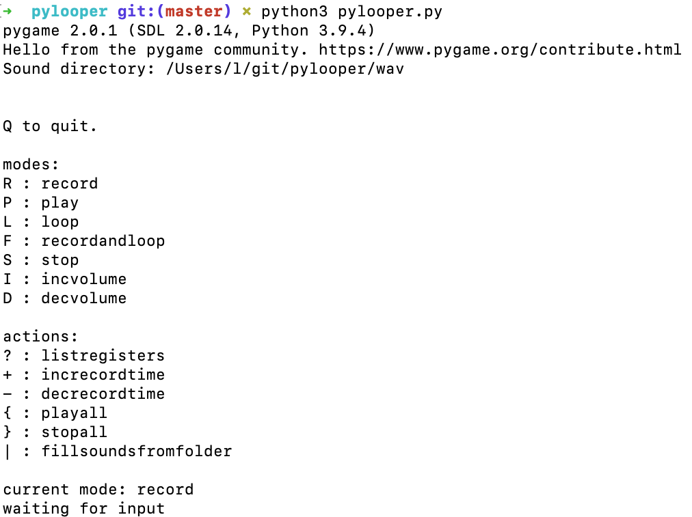

##pylooper
This is a more bare-bones substitute to looping over yourself in audacity.

###How to run code

1. First you need to [install pygame](http://www.pygame.org/download.shtml).
2. Then in `new.py`, change `workingdir` to where you want your sound files to go.
3. In a terminal, enter `python new.py`.

###How to use interface

There are 3 types of things you can do in the main loop:

* **registry keys** e.g. `a`, `q`, `5`, and `-`.  
    What pressing a registry key does depends on your mode.

* **mode keys** Press a mode key once and you will be placed in that mode until next mode key press. Modes change the behavior of a registry key press.

 * **E : edit** If you press `1` while in edit mode, the program immediately starts recording to the `1` slot and stops after `recordtime` seconds.

 * **D: decvolume** If you press `1` while in decvolume mode, whatever sound is in the `1` slot will be made 10% quieter.

 * **F: editandloop** Like edit mode, except the sounds you have recorded since you entered editandloopmode are constantly playing.

 * **I : incvolume** Like decvolume, except increases by 10%.

 * **L: loop** If you press `1` while in loop mode, whatever sound is in thre `1` slot will play on repeat. If you were then to press `2`, the `2` sound would start looping from the beginning. Note that loop mode does not automatically line up the beginning of sounds.

 * **P : play** If you press `1` while in play mode, then the `1` sound will play and stop when it is finished. Play mode allows overlapping.

 * **S : stop** If you press `1` whil in stop mode, then it will kill any playing or looping instances of that sound. If there are none, than no issue.

* **actions** Action keys act once and are not affected by modes.

 * **+ : increcordtime** Next time you edit/record a sound, the recording time will be 1 second longer

 * **- : decrecordtime** Next time you edit/record a sound, the record time will be 1 second shorter.

* **| : fillfilepathsfromfolder** In the working directory, there is a folder `s/` that contains all the sounds you recorded. When `|` is pressed, all the registries are filled with the files from that folder. E.g. `s/t.wav` would now play when you pressed `t` in edit mode.

* **{ : playall** plays all sounds currently stored in a registry. Prompts you when to play the next one.

* **} : stopall** stops all currently looping or playing sounds

* **< : updatesounds** like fillfilepathsfromfolder, but only operates on currently-used registries. _This description may be completely wrong._

The default `recordtime` is 5 seconds.
